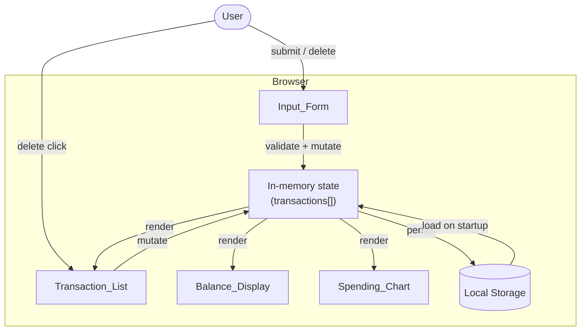
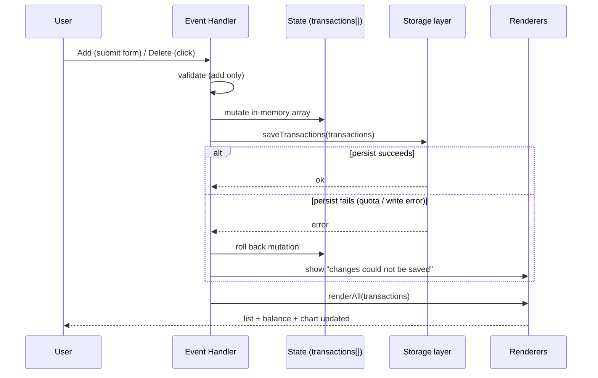

# Design Document

## Overview

The Expense & Budget Visualizer is a fully client-side single-page web application built with plain HTML, CSS, and vanilla JavaScript. It records spending transactions (item name, amount, category), persists them in the browser's Local Storage, and presents three synchronized views: a total balance display, a scrollable transaction list with per-item delete, and a category pie chart. There is no backend; all state lives in the browser.

The design satisfies the strict presentation constraints from Requirement 6: exactly one CSS file in `css/` and exactly one JavaScript file in `js/`, no framework, and support for current stable Chrome, Firefox, Edge, and Safari. The only external dependency is a charting library (Chart.js) loaded via CDN.

The application follows a small, explicit **unidirectional data flow**: user actions mutate a single in-memory list of transactions, that list is persisted to Local Storage, and every view re-renders from that same list. This keeps the balance, list, and chart consistent by construction and makes the sub-200ms update budget (Requirement 6.4, 6.5) easy to hit because all work happens synchronously in memory with a single small write to Local Storage.

### Design Goals

- **Single source of truth.** One in-memory array of transactions drives all three views.
- **Consistency by construction.** Add/delete always follow the same path: mutate state → persist → render all. No view updates independently.
- **Resilience.** Corrupt stored data and Local Storage write failures are handled gracefully without losing the user's in-memory work (Requirement 5.5, 5.6).
- **Zero build step.** Open `index.html` directly, or load as an unpacked browser extension; no bundler, transpiler, or server required (Requirement 6.1, 6.2).

## Architecture

### File Structure

```
expense-budget-visualizer/
├── index.html          # Markup + Chart.js CDN <script> + single css/js includes
├── css/
│   └── styles.css      # The one and only stylesheet
└── js/
    └── app.js          # The one and only application script
```

This structure directly enforces Requirement 6.1: one CSS file under `css/`, one JS file under `js/`. Chart.js is referenced via a CDN `<script>` tag in `index.html` and is not counted as an application JS file (it is a third-party library, not application code in `js/`).

### High-Level Structure



### Update Flow (Unidirectional)

Every add and every delete follows the identical sequence, which is the key to keeping the three views consistent and fast:



Because the mutation happens in memory first, `renderAll` operates on a plain array with no I/O, so the visible update easily lands within the 200ms budget (Requirement 6.4, 6.5). Persistence to Local Storage is synchronous and small, comfortably inside the 1s persist budget (Requirement 5.1, 5.2). On a persist failure, the in-memory mutation is rolled back so the displayed state continues to match what is actually stored (Requirement 5.6).

### Runtime / Browser Support

- Targets current stable Chrome, Firefox, Edge, and Safari (Requirement 6.2). All APIs used (`localStorage`, `JSON`, `Array` methods, `<canvas>` for Chart.js, `crypto.randomUUID`) are available in these browsers.
- A feature-detection guard at startup checks for the required capabilities (`window.localStorage`, `crypto.randomUUID` with a fallback, and `<canvas>` support). If a required feature is missing, the app shows an "unsupported browser" message and does not touch stored data (Requirement 6.6).
- The app makes no network calls except loading the Chart.js library from the CDN, so it works offline once the library is cached, and can be packaged as a browser extension by including Chart.js locally if desired.

## Components and Interfaces

The single `js/app.js` file is organized into cohesive modules using plain functions and a small module pattern (IIFE or ES module-style grouping via comment sections). The modules are logical groupings, not separate files, to satisfy the one-JS-file constraint.

### 1. State Module

Owns the single source of truth: the in-memory `transactions` array.

- `getTransactions()` → returns the current array.
- `setTransactions(list)` → replaces the array (used on load).
- `addTransaction(tx)` → appends a validated `Transaction`.
- `removeTransaction(id)` → removes the transaction with the given `id`.

The State module never talks to the DOM or Local Storage directly; callers (event handlers) coordinate persist + render.

### 2. Validation Module

Pure functions that validate raw form input before a transaction is created (Requirement 1.4, 1.5).

- `validateItemName(raw)` → `{ valid, value, message }`. Trims input; requires 1–100 characters after trimming.
- `validateAmount(raw)` → `{ valid, value, message }`. Parses a number; requires a finite number in `[0.01, 999999999.99]`.
- `validateCategory(raw)` → `{ valid, value, message }`. Requires one of `Food`, `Transport`, `Fun`.
- `validateForm({ name, amount, category })` → `{ valid, values, fieldMessages }`. Aggregates the above and returns per-field messages so the form can flag every offending field at once (Requirement 1.4).

### 3. Storage Module

Wraps Local Storage read/write with defensive parsing and error reporting.

- `loadTransactions()` → `{ transactions, error }`.
  - Reads the raw string under the storage key.
  - If absent → returns empty list, no error (Requirement 5.4).
  - If present → parses JSON and validates each entry against the `Transaction` shape. On parse failure or schema failure → returns empty list plus a `corrupt` error, and does **not** overwrite storage (Requirement 5.5).
- `saveTransactions(list)` → `{ ok, error }`.
  - Serializes and writes to Local Storage.
  - Catches `QuotaExceededError` and any write exception, returning `{ ok: false, error: 'quota' | 'write' }` (Requirement 5.6).

### 4. Calculation Module

Pure functions used by the renderers. Isolated so behavior is deterministic and independently verifiable.

- `computeTotalBalance(transactions)` → number rounded to 2 decimals, clamped to `[-999999999.99, 999999999.99]` (Requirement 3.1, 3.5).
- `computeCategoryTotals(transactions)` → `{ Food, Transport, Fun }` sums.
- `computeCategoryPercentages(categoryTotals)` → percentages per category rounded to one decimal place, omitting zero categories, with the rounding remainder assigned to the largest slice so the displayed percentages sum to exactly 100.0% (Requirement 4.1, 4.5).

### 5. Render Module

Reads state and updates the DOM. Each renderer is idempotent — calling it repeatedly with the same state produces the same DOM.

- `renderBalance(transactions)` → updates `Balance_Display`; adds a "negative" style class and a sign indication when the total is below zero (Requirement 3.6); shows `0.00` when empty (Requirement 3.4).
- `renderList(transactions)` → rebuilds `Transaction_List`. Each row shows item name, amount formatted to exactly two decimals, category, and a delete button carrying the transaction `id`. Renders the empty-state message when the list is empty (Requirement 2.1, 2.5, 2.6).
- `renderChart(transactions)` → updates the Chart.js pie chart from category percentages; shows the empty-state message and renders no slices when there is no spending (Requirement 4.4).
- `renderAll(transactions)` → calls all three renderers. This is the single function every event handler calls after mutating state.

### 6. Event / Controller Module

Wires DOM events to state changes and orchestrates the persist + render flow.

- `handleFormSubmit(event)` → prevents default, validates, and on success creates a `Transaction`, adds it, persists (with rollback on failure), clears the form, and calls `renderAll` (Requirement 1.2, 1.3, 5.1).
- `handleListClick(event)` → uses event delegation on the list container; if a delete control was clicked, removes the transaction by `id`, persists (with rollback), and calls `renderAll` (Requirement 2.4, 5.2).
- `init()` → runs feature detection, loads from storage, shows a corrupt-data message if needed, and performs the first `renderAll` (Requirement 5.3, 6.6).

### DOM Contract (index.html)

`index.html` provides stable element IDs/classes the script binds to:

- `#balance-display` — the balance area, positioned above list and chart (Requirement 3.1, 6.3).
- `#transaction-form` with fields `#item-name`, `#amount`, and `#category` (a `<select>` with Food/Transport/Fun), plus per-field message elements and a submit button (Requirement 1.1).
- `#transaction-list` — scrollable container (`max-height` + `overflow-y: auto` in CSS) for rows and the empty-state message (Requirement 2.2).
- `#chart-container` with a `<canvas id="spending-chart">` and a `#chart-empty` message element (Requirement 4.4).
- `#app-message` — a shared, visible region for corrupt-data, save-failure, and unsupported-browser messages (Requirement 5.5, 5.6, 6.6).

Body text is styled at a minimum of 14px (Requirement 6.3).

## Data Models

### Transaction

The core record. One object per recorded expense.

```javascript
/**
 * @typedef {Object} Transaction
 * @property {string}  id        - Unique id (crypto.randomUUID, with fallback).
 * @property {string}  name      - Item_Name, 1–100 chars after trim.
 * @property {number}  amount    - Positive number in [0.01, 999999999.99].
 * @property {"Food"|"Transport"|"Fun"} category - Fixed category set.
 */
```

Field rationale:

- `id` — a stable unique identifier so deletes target exactly one transaction regardless of duplicate names/amounts (Requirement 2.4). Generated with `crypto.randomUUID()`, falling back to a timestamp+random string if unavailable.
- `name` — validated to 1–100 characters after trimming (Requirement 1.1).
- `amount` — stored as a number; displayed formatted to two decimals (Requirement 2.1). Not rounded on storage to preserve entered precision; rounding is a display concern.
- `category` — restricted to the three fixed values (Requirement 1.1).

### Local Storage Schema

A single Local Storage key holds the entire dataset as a JSON document with a version field to allow future migration and to make validation explicit.

- **Key:** `ebv.transactions`
- **Value:** a JSON string of the following shape:

```json
{
  "version": 1,
  "transactions": [
    { "id": "a1b2...", "name": "Lunch", "amount": 12.5, "category": "Food" },
    { "id": "c3d4...", "name": "Bus fare", "amount": 3.75, "category": "Transport" }
  ]
}
```

Validation on load (Requirement 5.5) requires:

1. The raw string parses as JSON.
2. The root is an object with an array `transactions`.
3. Every entry has a string `id`, a string `name` of length 1–100, a finite `amount` in range, and a `category` in `{Food, Transport, Fun}`.

If any check fails, the loader returns an empty set and flags a corrupt-data error; the existing storage value is left untouched until the next successful save (Requirement 5.5). Entries that individually fail validation cause the whole load to be treated as corrupt, because a partially-trusted dataset cannot be reliably repaired without guessing user intent.

## Correctness Properties


*A property is a characteristic or behavior that should hold true across all valid executions of a system — essentially, a formal statement about what the system should do. Properties serve as the bridge between human-readable specifications and machine-verifiable correctness guarantees.*

The properties below capture the input-varying logic in the app (validation, balance and percentage calculation, list rendering, and storage round-trips). They are written as specifications of correct behavior. Per the project's lightweight testing approach, they are primarily verified manually (see Testing Strategy); they are documented here so the intended invariants are explicit and could be automated later without redesign.

### Property 1: Adding a valid transaction grows the list

*For any* transaction list and *any* valid input (item name 1–100 characters, amount in [0.01, 999,999,999.99], category in {Food, Transport, Fun}), adding the resulting transaction produces a list one longer than before that contains a transaction with the submitted name, amount, and category.

**Validates: Requirements 1.2**

### Property 2: Required-field validation flags every missing field

*For any* form input in which at least one of item name, amount, or category is empty/unselected, validation rejects the submission, retains all entered values, and returns a message for each field that is missing.

**Validates: Requirements 1.4**

### Property 3: Amount validation rejects out-of-range and non-numeric values

*For any* amount input that is not a finite number, is less than or equal to 0, or is greater than 999,999,999.99, amount validation rejects the submission and returns the amount range message; and *for any* finite number in [0.01, 999,999,999.99], amount validation accepts it.

**Validates: Requirements 1.5**

### Property 4: List rendering shows name, category, and two-decimal amount

*For any* transaction list, rendering the list produces one row per transaction, and each row contains that transaction's item name, its category, and its amount formatted with exactly two decimal places.

**Validates: Requirements 2.1**

### Property 5: Deleting a transaction removes it durably

*For any* non-empty transaction list and *any* transaction id in that list, deleting that transaction and then reloading from storage yields a set that does not contain the deleted id and still contains every other original transaction.

**Validates: Requirements 2.4**

### Property 6: Total balance equals the bounded, rounded sum of amounts

*For any* transaction list, the computed total balance equals the sum of all transaction amounts rounded to two decimal places and clamped to the range [-999,999,999.99, 999,999,999.99]; for the empty list the result is 0.00.

**Validates: Requirements 3.1, 3.5**

### Property 7: Category percentages are well-formed and complete

*For any* set of category totals whose sum is greater than 0, the computed percentages include one entry per category with a total greater than 0 (categories with a total of 0 are omitted), each percentage is rounded to one decimal place, and the displayed percentages sum to exactly 100.0% (any rounding remainder assigned to the largest slice).

**Validates: Requirements 4.1, 4.5**

### Property 8: Storage save/load round-trip preserves transactions

*For any* transaction list, saving it to storage and then loading it back yields an equal set of transactions (same ids, names, amounts, and categories).

**Validates: Requirements 5.1, 5.2, 5.3**

### Property 9: Corrupt stored data yields an empty set without data loss

*For any* stored value that fails to parse as JSON or fails validation as a well-formed set of transactions, loading returns an empty transaction set and a corrupt-data indication, and leaves the stored value unchanged.

**Validates: Requirements 5.5**

## Error Handling

The design treats error handling as a first-class concern because the app owns the user's only copy of their data.

### Input validation errors (Requirement 1.4, 1.5)

- The controller calls `validateForm` before any state mutation. On failure it does not mutate state, keeps all entered field values, and shows a per-field message next to each offending field. Amount errors use the specific range message.
- Validation is defensive against whitespace-only names (trimmed to empty), non-numeric amounts, and boundary values (exactly 0.01 and 999,999,999.99 are valid; 0 and above the max are not).

### Corrupt or unreadable stored data (Requirement 5.5)

- `loadTransactions` wraps `JSON.parse` in try/catch and validates the parsed shape. On any failure it returns an empty in-memory set plus a `corrupt` flag.
- The app displays a message in `#app-message` indicating stored data could not be read, and it does **not** write over the existing storage value. The bad value is only replaced on the next successful save (i.e., after the user takes an action that persists), so the user has a chance to inspect/recover it before it is overwritten.

### Persist failures — write error or quota exceeded (Requirement 5.6)

- `saveTransactions` wraps the write in try/catch and detects `QuotaExceededError` and generic write failures.
- The controller applies the state mutation in memory first, then persists. If the persist fails, it **rolls back** the in-memory mutation so the displayed views continue to match what is actually stored, and shows a "changes could not be saved" message. This prevents the UI from showing a state that was never persisted.

### Unsupported browser / render failure (Requirement 6.6)

- `init` runs feature detection (`localStorage`, canvas support, id generation). If a required feature is missing, it shows an "unsupported browser" message and skips rendering, without touching stored data so a supported browser can still read it later.
- The initial render is wrapped so that an unexpected rendering exception surfaces the unsupported/failed message rather than leaving a blank page, and previously entered data in storage is preserved.

### Chart library availability

- Chart.js is loaded from a CDN. If the library object is unavailable at startup (e.g., offline first load), the chart region shows its empty/unavailable message while the list and balance continue to function, so a chart-loading problem never blocks core expense tracking.

## Testing Strategy

Per the project constraints, there is **no test framework or build tooling to set up**. Testing is deliberately lightweight and centered on manual verification, with the correctness properties above serving as a written checklist of behaviors to confirm. Property-based test infrastructure is intentionally **not** mandated; the properties document intended invariants and can be automated later if desired without changing the design.

### Primary approach: manual verification checklist

Verify in at least one target browser (and spot-check the others per Requirement 6.2):

1. **Add flow (Req 1.2, 1.3, 3, 4, 5.1, 6.4):** Add a valid transaction; confirm it appears in the list, the form clears, the balance increases correctly, the chart updates, and the update feels instant (well under 200ms). Reload and confirm it persisted.
2. **Validation (Req 1.4, 1.5):** Submit with empty name, empty amount, and no category selected; confirm each offending field shows a message and values are retained. Submit amounts of `0`, `-5`, `abc`, `1000000000`, and boundary values `0.01` and `999999999.99`; confirm rejection/acceptance matches Property 3.
3. **List + delete (Req 2.1–2.6):** Confirm rows show name, category, and two-decimal amounts; add enough rows to force scrolling; delete an item and confirm it disappears and does not return after reload; delete all and confirm the empty-state message.
4. **Balance (Req 3.4–3.6):** Confirm empty balance is `0.00`; confirm two-decimal formatting; if seeding negative-balance data, confirm the negative indication renders.
5. **Chart (Req 4.1, 4.4, 4.5):** With mixed categories, confirm slices reflect percentages and only non-zero categories appear; with no spending, confirm the empty state and no slices.
6. **Persistence resilience (Req 5.4–5.6):** Manually set the storage key to invalid JSON via dev tools and reload; confirm the empty set, the corrupt-data message, and that the bad value is not immediately overwritten. Simulate a quota/write failure (e.g., temporarily stub `localStorage.setItem` to throw in the console) and confirm the in-memory list is unchanged and the save-failure message appears.
7. **Platform (Req 6.1–6.3, 6.6):** Confirm exactly one CSS file in `css/` and one JS file in `js/`; confirm balance sits above list and chart and body text is ≥14px; simulate a missing feature and confirm the unsupported message while stored data is retained.

### Optional automation (not required)

If the team later chooses to automate, the calculation, validation, and storage modules are written as pure, DOM-free functions so they can be exercised directly. Properties 1–9 map one-to-one to those pure functions, so a property-based library (for example, fast-check) could implement each property as a single test at ≥100 iterations, tagged `Feature: expense-budget-visualizer, Property {number}: {property text}`. This is offered as a future option, not a requirement for this feature.
